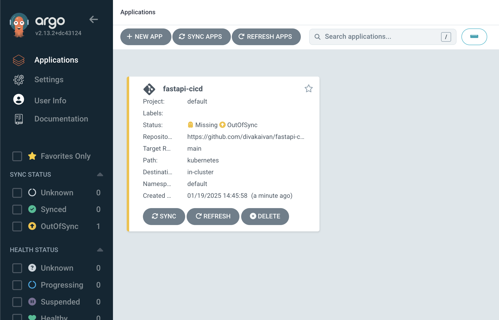
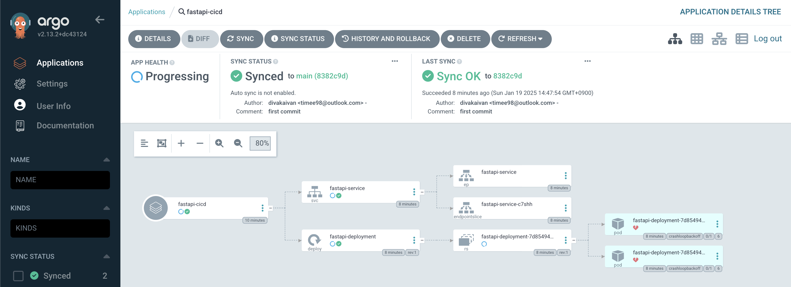

1. Create app + k8s files
2. Create a repo and add Docker secrets used in `.github/workflows/main.yml`
3. Run:

* `minikube start`
* `kubectl config use-context minikube`
* `kubectl crete namespace argocd`
* `kubectl apply -n argocd -f https://raw.githubusercontent.com/argoproj/argo-cd/stable/manifests/install.yaml`
* port forwarding to access argocd: `kubectl port-forward svc/argocd-server -n argocd 8080:443` -> go to `localhost:8080` and use `admin` and `kubectl get secret argocd-initial-admin-secret -n argocd -o jsonpath="{.data.password}" | base64 --decode` for the password. There will be nothing initially
* To add (replace repo name):

(make sure to login `argocd login localhost:8080` if this is your 1st time using argocd locally)

```
argocd app create fastapi-cicd \
    --repo https://github.com/divakaivan/fastapi-cicd.git \
    --path kubernetes \
    --dest-server https://kubernetes.default.svc \
    --dest-namespace default \
    --revision main
```

Result:



Next, sync the connection between github and argocd -> `argocd app sync fastapi-cicd`



On every push to the main branch, a GitHub Actions workflow builds the FastAPI server container and pushes it to Docker Hub. ArgoCD manages the deployment of this container to Kubernetes clusters by syncing the cluster's state with the manifests defined in the Git repository.